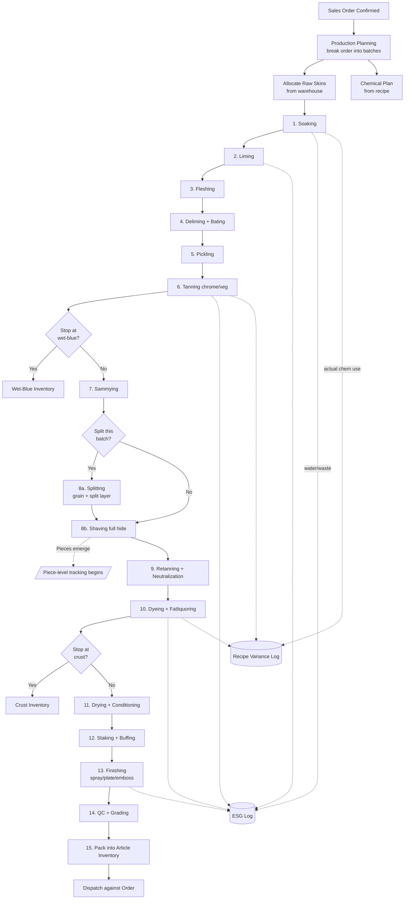
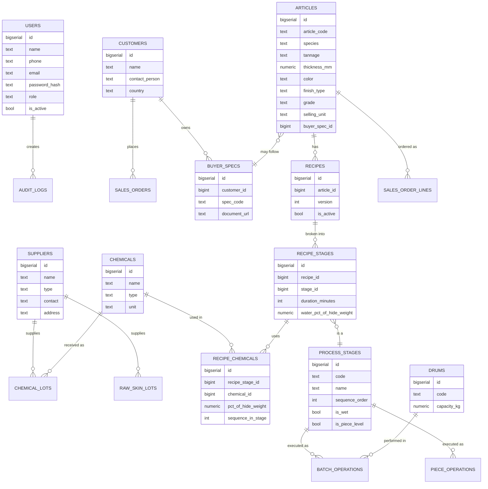
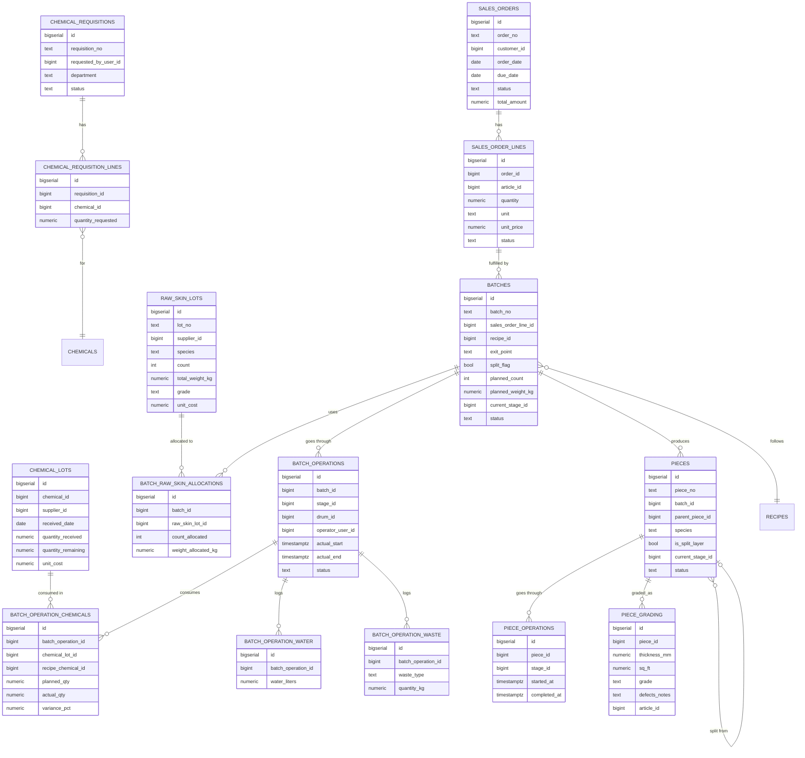
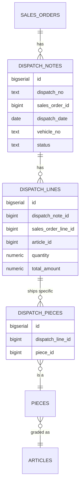

# Leather ERP — Process Mapping & Schema Design

> Design document for a greenfield ERP serving a Bangladesh tannery running mixed wet-blue / crust / finished production for cow + goat hides under a make-to-order model.

---

## 1. Decisions locked in

| Area | Decision |
|---|---|
| Production scope | Wet-blue, crust, **and** finished — same factory, same schema |
| Tracking model | **Hybrid** — batch-level for wet ops, piece-level after splitting/shaving |
| Production trigger | Make-to-order (buyer order → batches) |
| Recipes | Standard recipe per article, deviations logged as exceptions |
| Splitting | Conditional — `split_flag` on the batch, parent→child piece lineage when split |
| Species | Cow + goat |
| Costing | Inventory valuation only (raw skin + chemicals → finished value) |
| ESG | Internal visibility only — water / chemicals / waste per batch with trends |
| Roles | 9 (operator, shift in-charge, production manager, warehouse, procurement, QC, ESG, sales/dispatch, owner) |
| Deliverable | Process flow + ERD + table specs (this doc) |

## 2. Defaults applied (push back if wrong)

- Single facility
- Postgres conventions in column types (`bigserial`, `numeric`, `jsonb`, `timestamptz`)
- WIP visibility = batch status everywhere + piece counts at **shaving, dyeing, finishing, QC**
- Web app primary; mobile-friendly forms for floor data entry
- Soft deletes via `deleted_at` on master tables; hard append on transactional tables
- All money in BDT with currency code stored for future flexibility
- All weights in kg, areas in sq ft (BD industry convention)

---

## 3. Process flow

This is the canonical pipeline a customer order travels through. Stages 1–7 are wet & batch-level; piece-level tracking begins at splitting.



**Reading note.** Three product exit points (wet-blue, crust, finished) feed three distinct inventory pools. Same batch can produce only one product type — the exit decision is made when the batch is created from the order line, not later.

---

## 4. Module breakdown

| Module | What it does | Primary roles |
|---|---|---|
| **Sales & Orders** | Customer orders, article spec, due dates, dispatch | Sales/dispatch, owner |
| **Production Planning** | Order → batch breakdown, recipe selection, raw skin allocation | Production manager |
| **Procurement** | Chemical requisitions, supplier POs, raw skin purchases | Procurement, warehouse |
| **Warehouse** | Chemical & raw skin stock, FIFO lot management | Warehouse keeper |
| **Beam House Ops** | Soaking → pickling (batch-level data entry) | Floor operator, shift in-charge |
| **Main Drum Ops** | Tanning → fatliquoring (batch & piece) | Floor operator, shift in-charge |
| **Finishing** | Drying through finishing (piece-level) | Floor operator, shift in-charge |
| **QC & Grading** | Per-piece grade, sq ft, defects, article assignment | QC |
| **Inventory** | Wet-blue / crust / finished pools, valuation | Warehouse, sales, owner |
| **Dispatch** | Allocate pieces to orders, invoice, ship | Sales/dispatch |
| **ESG / Waste** | Water, chemical, solid-waste logs with trends | ESG officer |
| **Recipe Master** | Article recipes, planned vs actual variance | Production manager, QC |

---

## 5. Entity-relationship diagrams

I split the ERD into three domains because one giant diagram with 30+ tables is unreadable. FKs that cross domains are noted in each relevant diagram.

### 5.1 Master & reference data



### 5.2 Procurement, production, pieces



### 5.3 Inventory & dispatch



**Inventory note.** I'm not creating separate `wet_blue_inventory`, `crust_inventory`, `finished_inventory` tables. They're all just **views** over `pieces` filtered by `current_stage_id` and `status = 'in_stock'`. Same for chemical & raw-skin warehouse — views over the `_lots` tables aggregating `quantity_remaining`. One source of truth, no sync bugs.

---

## 6. Detailed table specifications

### 6.1 Master data

#### `users`
| Column | Type | Notes |
|---|---|---|
| id | bigserial PK | |
| name | text NOT NULL | |
| phone | text | |
| email | text UNIQUE | |
| password_hash | text NOT NULL | |
| role | text NOT NULL | enum: `floor_operator`, `shift_in_charge`, `production_manager`, `warehouse_keeper`, `procurement`, `qc`, `esg_officer`, `sales_dispatch`, `owner` |
| is_active | bool DEFAULT true | |
| created_at | timestamptz DEFAULT now() | |
| deleted_at | timestamptz | soft delete |

#### `suppliers`
| Column | Type | Notes |
|---|---|---|
| id | bigserial PK | |
| name | text NOT NULL | |
| type | text NOT NULL | enum: `chemical`, `raw_skin`, `both` |
| contact_person | text | |
| phone | text | |
| address | text | |
| district | text | for raw skin sourcing visibility |
| tax_id | text | |
| is_active | bool DEFAULT true | |
| created_at | timestamptz DEFAULT now() | |

#### `customers`
| Column | Type | Notes |
|---|---|---|
| id | bigserial PK | |
| name | text NOT NULL | |
| contact_person | text | |
| phone | text | |
| email | text | |
| address | text | |
| country | text | export tracking |
| tax_id | text | |
| is_active | bool DEFAULT true | |
| created_at | timestamptz DEFAULT now() | |

#### `chemicals`
| Column | Type | Notes |
|---|---|---|
| id | bigserial PK | |
| name | text NOT NULL | |
| code | text UNIQUE | internal SKU |
| type | text | enum: `chrome_salt`, `syntan`, `fatliquor`, `dye`, `acid`, `lime`, `enzyme`, `finish_chem`, `other` |
| unit | text NOT NULL | enum: `kg`, `L` |
| description | text | |
| is_active | bool DEFAULT true | |

#### `articles`
The product spec — every unique combination of (species + tannage + thickness + color + finish + embossing + grade + selling unit + buyer spec) is one article.
| Column | Type | Notes |
|---|---|---|
| id | bigserial PK | |
| article_code | text UNIQUE NOT NULL | e.g. `COW-FN-1.4-BLK-FG-A-SF` |
| name | text | human-readable |
| species | text NOT NULL | enum: `cow`, `goat` |
| tannage | text NOT NULL | enum: `wet_blue`, `crust`, `finished` |
| thickness_mm | numeric(4,2) | |
| color | text | |
| finish_type | text | enum: `full_grain`, `corrected`, `suede`, `nubuck`, `aniline`, `pigmented`, `none` |
| embossing | text | nullable; pattern code |
| grade | text | enum: `a`, `b`, `c` — grade target, actual grade per piece |
| selling_unit | text NOT NULL | enum: `sq_ft`, `piece`, `kg` |
| buyer_spec_id | bigint FK buyer_specs.id | nullable; if buyer-specific |
| description | text | |
| is_active | bool DEFAULT true | |
| created_at | timestamptz DEFAULT now() | |

> **Index:** unique partial index on `(species, tannage, thickness_mm, color, finish_type, embossing, grade, selling_unit, buyer_spec_id)` — prevents duplicate article rows.

#### `buyer_specs`
| Column | Type | Notes |
|---|---|---|
| id | bigserial PK | |
| customer_id | bigint FK customers.id NOT NULL | |
| spec_code | text NOT NULL | |
| description | text | |
| document_url | text | uploaded PDF spec sheet |
| created_at | timestamptz DEFAULT now() | |

#### `process_stages`
Seed this table once with the canonical stage list — do not let users add stages freely.
| Column | Type | Notes |
|---|---|---|
| id | bigserial PK | |
| code | text UNIQUE NOT NULL | machine code |
| name | text NOT NULL | display |
| sequence_order | int NOT NULL | 1..N |
| is_wet | bool NOT NULL | water + chemicals stage |
| is_piece_level | bool NOT NULL | true from splitting onwards |
| applies_to_tannage | text[] | which exit points pass through |

**Seed data:**
| seq | code | name | wet | piece | tannage |
|---|---|---|---|---|---|
| 1 | soaking | Soaking | ✓ | | wb,cr,fn |
| 2 | liming | Liming | ✓ | | wb,cr,fn |
| 3 | fleshing | Fleshing | ✓ | | wb,cr,fn |
| 4 | deliming_bating | Deliming + Bating | ✓ | | wb,cr,fn |
| 5 | pickling | Pickling | ✓ | | wb,cr,fn |
| 6 | tanning | Tanning | ✓ | | wb,cr,fn |
| 7 | sammying | Sammying | | | cr,fn |
| 8 | splitting | Splitting | | conditional | cr,fn |
| 9 | shaving | Shaving | | ✓ | cr,fn |
| 10 | retanning | Retanning + Neutralization | ✓ | ✓ | cr,fn |
| 11 | dyeing_fatliquor | Dyeing + Fatliquoring | ✓ | ✓ | cr,fn |
| 12 | drying_conditioning | Drying + Conditioning | | ✓ | fn |
| 13 | staking_buffing | Staking + Buffing | | ✓ | fn |
| 14 | finishing | Finishing | | ✓ | fn |
| 15 | qc_grading | QC + Grading | | ✓ | wb,cr,fn |
| 16 | packing | Packing | | ✓ | wb,cr,fn |

#### `recipes`
| Column | Type | Notes |
|---|---|---|
| id | bigserial PK | |
| article_id | bigint FK articles.id NOT NULL | |
| version | int NOT NULL | bump on any change |
| is_active | bool DEFAULT true | only one active per article |
| created_by | bigint FK users.id | |
| created_at | timestamptz DEFAULT now() | |
| notes | text | |

> **Index:** unique partial `(article_id) WHERE is_active = true` — enforces single active recipe.

#### `recipe_stages`
| Column | Type | Notes |
|---|---|---|
| id | bigserial PK | |
| recipe_id | bigint FK recipes.id NOT NULL | |
| stage_id | bigint FK process_stages.id NOT NULL | |
| duration_minutes | int | drum run time |
| drum_rpm | int | nullable |
| water_pct_of_hide_weight | numeric(5,2) | e.g. 100% means water = hide weight |
| temperature_c | numeric(4,1) | nullable |
| notes | text | |

#### `recipe_chemicals`
| Column | Type | Notes |
|---|---|---|
| id | bigserial PK | |
| recipe_stage_id | bigint FK recipe_stages.id NOT NULL | |
| chemical_id | bigint FK chemicals.id NOT NULL | |
| pct_of_hide_weight | numeric(6,3) | most chemicals dosed this way |
| fixed_amount | numeric(10,3) | use when not pct-based |
| unit | text | kg or L (overrides chemical default if needed) |
| sequence_in_stage | int | order of addition |
| add_after_minutes | int | timing offset within stage |
| notes | text | |

> **Constraint:** `CHECK (pct_of_hide_weight IS NOT NULL OR fixed_amount IS NOT NULL)` — must specify one.

#### `drums`
| Column | Type | Notes |
|---|---|---|
| id | bigserial PK | |
| code | text UNIQUE NOT NULL | e.g. D-01 |
| location | text | beam_house / main / dyeing |
| capacity_kg | numeric(10,2) | |
| is_active | bool DEFAULT true | |

---

### 6.2 Procurement & raw materials

#### `chemical_requisitions`
Internal request from production/R&D before procurement actually buys.
| Column | Type | Notes |
|---|---|---|
| id | bigserial PK | |
| requisition_no | text UNIQUE NOT NULL | |
| requested_by_user_id | bigint FK users.id NOT NULL | |
| department | text NOT NULL | enum: `production`, `r_and_d`, `pd` |
| reason | text | |
| status | text NOT NULL | enum: `pending`, `approved`, `fulfilled`, `rejected` |
| approved_by_user_id | bigint FK users.id | |
| approved_at | timestamptz | |
| created_at | timestamptz DEFAULT now() | |

#### `chemical_requisition_lines`
| Column | Type | Notes |
|---|---|---|
| id | bigserial PK | |
| requisition_id | bigint FK chemical_requisitions.id NOT NULL | |
| chemical_id | bigint FK chemicals.id NOT NULL | |
| quantity_requested | numeric(12,3) NOT NULL | |
| unit | text NOT NULL | |
| notes | text | |

#### `chemical_lots`
Each delivery from a supplier becomes a lot — gives FIFO consumption and per-lot costing.
| Column | Type | Notes |
|---|---|---|
| id | bigserial PK | |
| chemical_id | bigint FK chemicals.id NOT NULL | |
| supplier_id | bigint FK suppliers.id NOT NULL | |
| lot_no | text NOT NULL | supplier's batch number |
| received_date | date NOT NULL | |
| drum_count | int | number of physical drums received |
| quantity_received | numeric(12,3) NOT NULL | |
| quantity_remaining | numeric(12,3) NOT NULL | decremented on consumption |
| unit | text NOT NULL | |
| grade | text | |
| unit_cost | numeric(12,4) NOT NULL | for inventory valuation |
| expiry_date | date | |
| status | text DEFAULT 'available' | enum: `available`, `depleted`, `expired`, `quarantined` |
| created_at | timestamptz DEFAULT now() | |

> **Index:** `(chemical_id, status, received_date)` — for FIFO picking.

#### `raw_skin_lots`
| Column | Type | Notes |
|---|---|---|
| id | bigserial PK | |
| lot_no | text UNIQUE NOT NULL | |
| supplier_id | bigint FK suppliers.id NOT NULL | |
| supplier_district | text | for traceability |
| buyer_user_id | bigint FK users.id | who procured it |
| received_date | date NOT NULL | |
| species | text NOT NULL | enum: `cow`, `goat` |
| count | int NOT NULL | number of skins |
| total_weight_kg | numeric(10,2) NOT NULL | |
| average_size | text | s/m/l descriptor |
| grade | text | enum: `a`, `b`, `c` (assigned at receiving) |
| count_remaining | int NOT NULL | decremented on allocation |
| weight_remaining_kg | numeric(10,2) NOT NULL | |
| unit_cost_per_kg | numeric(12,4) NOT NULL | |
| status | text DEFAULT 'available' | |
| created_at | timestamptz DEFAULT now() | |

---

### 6.3 Sales & production

#### `sales_orders`
| Column | Type | Notes |
|---|---|---|
| id | bigserial PK | |
| order_no | text UNIQUE NOT NULL | |
| customer_id | bigint FK customers.id NOT NULL | |
| order_date | date NOT NULL | |
| due_date | date NOT NULL | |
| status | text NOT NULL | enum: `draft`, `confirmed`, `in_production`, `partial_dispatched`, `completed`, `cancelled` |
| total_amount | numeric(14,2) | |
| currency | text DEFAULT 'BDT' | |
| notes | text | |
| created_by | bigint FK users.id | |
| created_at | timestamptz DEFAULT now() | |

#### `sales_order_lines`
| Column | Type | Notes |
|---|---|---|
| id | bigserial PK | |
| order_id | bigint FK sales_orders.id NOT NULL | |
| article_id | bigint FK articles.id NOT NULL | |
| quantity | numeric(12,3) NOT NULL | |
| unit | text NOT NULL | should match article.selling_unit |
| unit_price | numeric(12,4) NOT NULL | |
| line_total | numeric(14,2) | computed |
| quantity_dispatched | numeric(12,3) DEFAULT 0 | running total |
| status | text NOT NULL | enum: `pending`, `in_production`, `ready`, `dispatched` |

#### `batches`
The atomic production unit. Each batch fulfills one order line (or is a buffer-stock build with `sales_order_line_id IS NULL`).
| Column | Type | Notes |
|---|---|---|
| id | bigserial PK | |
| batch_no | text UNIQUE NOT NULL | |
| sales_order_line_id | bigint FK sales_order_lines.id | nullable for buffer stock |
| recipe_id | bigint FK recipes.id NOT NULL | snapshot of active recipe at batch creation |
| exit_point | text NOT NULL | enum: `wet_blue`, `crust`, `finished` — determines pipeline length |
| split_flag | bool DEFAULT false | set true if batch will be split |
| planned_count | int NOT NULL | number of skins planned |
| planned_weight_kg | numeric(10,2) NOT NULL | |
| actual_start_count | int | |
| actual_start_weight_kg | numeric(10,2) | |
| current_stage_id | bigint FK process_stages.id | |
| status | text NOT NULL | enum: `planned`, `in_progress`, `completed`, `on_hold`, `cancelled` |
| started_at | timestamptz | |
| completed_at | timestamptz | |
| notes | text | |
| created_at | timestamptz DEFAULT now() | |

#### `batch_raw_skin_allocations`
Many-to-many: a batch can pull from multiple raw skin lots; a raw skin lot can be split across batches.
| Column | Type | Notes |
|---|---|---|
| id | bigserial PK | |
| batch_id | bigint FK batches.id NOT NULL | |
| raw_skin_lot_id | bigint FK raw_skin_lots.id NOT NULL | |
| count_allocated | int NOT NULL | |
| weight_allocated_kg | numeric(10,2) NOT NULL | |
| allocated_at | timestamptz DEFAULT now() | |

#### `batch_operations`
One row per (batch, stage) combination — the actual execution log.
| Column | Type | Notes |
|---|---|---|
| id | bigserial PK | |
| batch_id | bigint FK batches.id NOT NULL | |
| stage_id | bigint FK process_stages.id NOT NULL | |
| drum_id | bigint FK drums.id | nullable for non-drum stages |
| operator_user_id | bigint FK users.id | |
| supervisor_user_id | bigint FK users.id | |
| planned_start | timestamptz | |
| actual_start | timestamptz | |
| planned_end | timestamptz | |
| actual_end | timestamptz | |
| status | text NOT NULL | enum: `pending`, `in_progress`, `completed`, `on_hold` |
| notes | text | |

> **Index:** `(batch_id, stage_id)` UNIQUE — one op per stage per batch.

#### `batch_operation_chemicals`
Actual chemical consumption with planned vs actual variance.
| Column | Type | Notes |
|---|---|---|
| id | bigserial PK | |
| batch_operation_id | bigint FK batch_operations.id NOT NULL | |
| chemical_lot_id | bigint FK chemical_lots.id NOT NULL | |
| recipe_chemical_id | bigint FK recipe_chemicals.id | nullable for ad-hoc additions |
| planned_qty | numeric(12,3) | from recipe |
| actual_qty | numeric(12,3) NOT NULL | what was actually dispensed |
| unit | text NOT NULL | |
| variance_pct | numeric(6,2) | computed: (actual - planned) / planned * 100 |
| dispensed_by_user_id | bigint FK users.id | |
| dispensed_at | timestamptz NOT NULL | |
| deviation_reason | text | required if |variance_pct| > threshold |

#### `batch_operation_water`
| Column | Type | Notes |
|---|---|---|
| id | bigserial PK | |
| batch_operation_id | bigint FK batch_operations.id NOT NULL | |
| water_liters | numeric(10,2) NOT NULL | |
| logged_at | timestamptz DEFAULT now() | |

#### `batch_operation_waste`
| Column | Type | Notes |
|---|---|---|
| id | bigserial PK | |
| batch_operation_id | bigint FK batch_operations.id NOT NULL | |
| waste_type | text NOT NULL | enum: `fleshing`, `hair`, `trimming`, `shavings`, `buffing_dust`, `sludge`, `other` |
| quantity_kg | numeric(10,2) NOT NULL | |
| disposal_method | text | enum: `cetp`, `landfill`, `byproduct_sale`, `incinerated`, `other` |
| logged_at | timestamptz DEFAULT now() | |

---

### 6.4 Pieces (post-splitting)

#### `pieces`
One row per physical piece of leather from splitting/shaving onwards.
| Column | Type | Notes |
|---|---|---|
| id | bigserial PK | |
| piece_no | text UNIQUE NOT NULL | e.g. B0047-P0123 |
| batch_id | bigint FK batches.id NOT NULL | |
| parent_piece_id | bigint FK pieces.id | nullable; set for split layer pointing to its grain piece (or vice versa) |
| species | text NOT NULL | denormalized from batch for query speed |
| is_split_layer | bool DEFAULT false | true = the lower split layer |
| current_stage_id | bigint FK process_stages.id | |
| status | text NOT NULL | enum: `in_progress`, `in_stock`, `dispatched`, `rejected` |
| article_id | bigint FK articles.id | assigned at QC/grading; null until then |
| created_at | timestamptz DEFAULT now() | |

#### `piece_operations`
Mirror of `batch_operations` but at piece level.
| Column | Type | Notes |
|---|---|---|
| id | bigserial PK | |
| piece_id | bigint FK pieces.id NOT NULL | |
| stage_id | bigint FK process_stages.id NOT NULL | |
| operator_user_id | bigint FK users.id | |
| started_at | timestamptz | |
| completed_at | timestamptz | |
| status | text NOT NULL | |
| notes | text | |

> Only logged at the four inflection stages (shaving, dyeing, finishing, QC) by default. Operators tap a piece into a stage; the op auto-completes when the next stage is started.

#### `piece_grading`
| Column | Type | Notes |
|---|---|---|
| id | bigserial PK | |
| piece_id | bigint FK pieces.id NOT NULL UNIQUE | one grading per piece |
| thickness_mm | numeric(4,2) NOT NULL | |
| sq_ft | numeric(8,2) NOT NULL | |
| grade | text NOT NULL | enum: `a`, `b`, `c`, `reject` |
| color_match_score | numeric(3,1) | 0–10 vs target |
| defects_notes | text | |
| article_id | bigint FK articles.id NOT NULL | the article this piece is assigned to |
| graded_by_user_id | bigint FK users.id | |
| graded_at | timestamptz NOT NULL | |

> On insert, trigger updates `pieces.article_id` and `pieces.status = 'in_stock'`.

---

### 6.5 Dispatch

#### `dispatch_notes`
| Column | Type | Notes |
|---|---|---|
| id | bigserial PK | |
| dispatch_no | text UNIQUE NOT NULL | |
| sales_order_id | bigint FK sales_orders.id NOT NULL | |
| dispatch_date | date NOT NULL | |
| vehicle_no | text | |
| driver_name | text | |
| status | text NOT NULL | enum: `draft`, `dispatched`, `delivered`, `returned` |
| notes | text | |
| created_by | bigint FK users.id | |
| created_at | timestamptz DEFAULT now() | |

#### `dispatch_lines`
| Column | Type | Notes |
|---|---|---|
| id | bigserial PK | |
| dispatch_note_id | bigint FK dispatch_notes.id NOT NULL | |
| sales_order_line_id | bigint FK sales_order_lines.id NOT NULL | |
| article_id | bigint FK articles.id NOT NULL | |
| quantity | numeric(12,3) NOT NULL | |
| unit | text NOT NULL | |
| unit_price | numeric(12,4) NOT NULL | |
| total_amount | numeric(14,2) NOT NULL | |

#### `dispatch_pieces`
The actual pieces shipped — gives full traceability backwards.
| Column | Type | Notes |
|---|---|---|
| id | bigserial PK | |
| dispatch_line_id | bigint FK dispatch_lines.id NOT NULL | |
| piece_id | bigint FK pieces.id NOT NULL UNIQUE | one piece dispatched once |

> On insert, trigger sets `pieces.status = 'dispatched'`.

---

### 6.6 Audit & system

#### `audit_logs`
| Column | Type | Notes |
|---|---|---|
| id | bigserial PK | |
| user_id | bigint FK users.id | |
| action | text NOT NULL | `create`, `update`, `delete` |
| entity_type | text NOT NULL | table name |
| entity_id | bigint NOT NULL | |
| before_data | jsonb | |
| after_data | jsonb | |
| ip_address | inet | |
| created_at | timestamptz DEFAULT now() | |

> Trigger-based; covers all transactional tables.

---

## 7. Inventory views (no separate tables)

```sql
-- Chemical warehouse
CREATE VIEW v_chemical_warehouse AS
SELECT
  c.id AS chemical_id,
  c.name,
  c.unit,
  SUM(cl.quantity_remaining) AS total_remaining,
  SUM(cl.quantity_remaining * cl.unit_cost) AS total_value_bdt,
  COUNT(*) FILTER (WHERE cl.status = 'available') AS active_lots
FROM chemicals c
LEFT JOIN chemical_lots cl ON cl.chemical_id = c.id AND cl.status = 'available'
GROUP BY c.id, c.name, c.unit;

-- Raw skin warehouse
CREATE VIEW v_raw_skin_warehouse AS
SELECT
  species,
  grade,
  SUM(count_remaining) AS total_count,
  SUM(weight_remaining_kg) AS total_weight_kg,
  SUM(weight_remaining_kg * unit_cost_per_kg) AS total_value_bdt
FROM raw_skin_lots
WHERE status = 'available'
GROUP BY species, grade;

-- Finished/crust/wet-blue inventory
CREATE VIEW v_article_inventory AS
SELECT
  a.id AS article_id,
  a.article_code,
  a.tannage,
  COUNT(p.id) AS pieces_in_stock,
  SUM(pg.sq_ft) AS total_sq_ft
FROM articles a
LEFT JOIN pieces p ON p.article_id = a.id AND p.status = 'in_stock'
LEFT JOIN piece_grading pg ON pg.piece_id = p.id
GROUP BY a.id, a.article_code, a.tannage;
```

---

## 8. Dashboard recommendations per role

| Role | Primary widgets |
|---|---|
| **Floor operator** | Today's assigned operations · "Tap to start/end stage" form · Chemical dispense entry with planned qty pre-filled · Photo upload for issues |
| **Shift in-charge** | Live batch board (current stage per batch) · Operator status · Pending approvals (deviations, requisitions) · Shift handover note |
| **Production manager** | All batches by stage (kanban view) · Variance alerts (recipe deviations, schedule slips) · Weekly throughput · Order fulfillment status |
| **Warehouse keeper** | Chemical stock by lot (FIFO list) · Raw skin stock by species/grade · Reorder alerts · Pending requisitions to fulfill |
| **Procurement** | Requisitions to act on · Open POs · Supplier delivery tracker · Price trend per chemical |
| **QC** | Pieces awaiting grading queue · Recent grading stats (yield by grade) · Defect frequency by batch |
| **Sales/dispatch** | Open orders · Ready-to-dispatch articles · Dispatch history · Order aging |
| **ESG officer** | Water/chemical/waste per batch · Monthly trend lines · Per-article water usage · Chrome consumption trend |
| **Owner/director** | Order pipeline value · Inventory value (raw + WIP + finished) · Batches in progress · Variance & alert digest · Monthly P&L proxy |

---

## 9. Key design decisions & tradeoffs

| Decision | Why | Tradeoff accepted |
|---|---|---|
| Hybrid batch+piece tracking | Matches industry practice; minimizes data entry on wet ops | Slightly more complex schema (two op tables) |
| Recipe versioning + snapshot to batch | Production manager can edit recipes without breaking historical batches | Recipe edits don't retroactively affect old variance reports — *correct* behavior, but explain to users |
| Inventory as views, not tables | Single source of truth; no sync logic | Slightly slower queries on huge stock lists — solvable with materialized views if needed |
| `parent_piece_id` self-FK on pieces | Handles split lineage cleanly | Requires care when querying "all pieces of batch X" — use `WHERE batch_id = X` not a tree walk |
| Buffer stock allowed (`sales_order_line_id NULL`) | You said make-to-order, but reality is some safety stock | Need clear UI distinction between stock build vs order fulfillment |
| Soft delete only on master, append-only on transactional | Audit trail for compliance + ability to rename a customer without breaking orders | Slightly more complex queries (`WHERE deleted_at IS NULL`) |
| `exit_point` set at batch creation, not later | Forces planning discipline; simpler pipeline logic | A batch can't change its mind mid-process — but in practice this is correct, you don't decide post-tanning |

---

## 10. What's deferred (Phase 2 candidates)

These came up in the interview but didn't make Phase 1:

- **Full job costing** (labor + utility allocation per batch → cost per sq ft) — you said inventory valuation only
- **Formal compliance reporting** (LWG audit trail, CETP reports) — you said internal visibility only
- **Multi-facility support** — assumed single site
- **Forecasting / MRP** (chemical reorder based on order pipeline) — easy add later
- **Mobile-native app** — web-mobile-friendly is enough for now
- **Bengali UI** — labels can layer onto the schema without changes
- **API for buyer integrations** (some buyers want EDI for orders/dispatch)
- **Drum scheduling optimization** — capacity planning across drums

---

## 11. Open questions before implementation

1. **Tech stack** — Postgres is assumed in column types. Backend (Laravel / Django / Node) and frontend (React / Vue / server-rendered) preference?
2. **Hosting** — cloud (AWS/Azure/local provider) or on-prem server in factory?
3. **Capacity** — how many drums, batches/day, hides/day? Affects index strategy and whether to plan for materialized views early.
4. **Dispatch units** — is dispatch always against an order, or do you also do over-the-counter sales?
5. **Returns / rework** — do rejected pieces get re-graded or scrapped?
6. **Variance threshold** — what % deviation on chemical use should trigger a deviation_reason requirement?
7. **Buffer stock policy** — if you do build buffer stock, who authorizes it?

Once these are answered, the schema above translates to runnable Postgres DDL with one pass.
